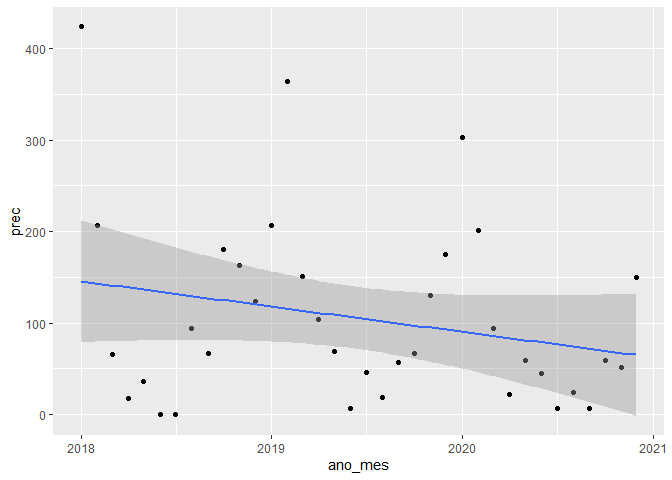

<!-- README.md is generated from README.Rmd. Please edit that file -->

# carbono-camila

``` r
library(tidyverse)
library(lubridate)
library(scales)
library(readxl)
library(patchwork)
library(hrbrthemes)
```

``` r
dados <- read_xlsx("data/Dados Gerais.xlsx") %>% 
  janitor::clean_names()
dados <- dados %>% 
  mutate(
    cultura = str_remove(str_extract(tratamento, ".*_"),"_")
  )
glimpse(dados)
#> Rows: 585
#> Columns: 22
#> $ ciclo            <dbl> 1, 1, 1, 1, 1, 1, 1, 1, 1, 1, 1, 1, 1, 1, 1, 1, 1, 1,~
#> $ tratamento       <chr> "amendoim_pd", "amendoim_pd", "amendoim_pd", "amendoi~
#> $ cultura          <chr> "amendoim", "amendoim", "amendoim", "amendoim", "amen~
#> $ preparo          <chr> "pd", "pd", "pd", "pd", "pd", "pd", "pd", "pd", "pd",~
#> $ linha_entrelinha <chr> "Média_ponderada", "Média_ponderada", "Média_ponderad~
#> $ profundidade     <chr> "0_20", "0_20", "0_20", "20_30", "20_30", "20_30", "3~
#> $ bloco            <chr> "b1", "b2", "b3", "b1", "b2", "b3", "b1", "b2", "b3",~
#> $ ds               <dbl> 1.541851, 1.656825, 1.490723, 1.663634, 1.663012, 1.6~
#> $ macro            <dbl> 0.22259881, 0.15329831, 0.19500683, 0.14215579, 0.144~
#> $ micro            <dbl> 0.2045018, 0.2310544, 0.2080318, 0.2416834, 0.2400504~
#> $ pt               <dbl> 0.4271007, 0.3843528, 0.4030386, 0.3838392, 0.3840695~
#> $ dp               <dbl> 2.69, 2.69, 2.69, 2.70, 2.70, 2.70, 2.69, 2.69, 2.69,~
#> $ rp               <dbl> 1.0076667, 1.0002333, 0.9988667, 1.4013000, 1.9214000~
#> $ dmp              <dbl> 0.7394362, 0.6215094, 0.6568675, 0.9229124, 0.9356794~
#> $ p_resina         <dbl> 3.198333, 3.531667, 2.910000, 1.000000, 1.730000, 1.0~
#> $ p_h              <dbl> 5.103500, 5.436167, 5.270333, 4.254000, 4.700000, 4.9~
#> $ k                <dbl> 0.7126667, 0.7558333, 0.6550000, 0.2000000, 0.3270000~
#> $ ca               <dbl> 14.573333, 15.406667, 14.370000, 12.460000, 9.540000,~
#> $ mg               <dbl> 7.509167, 7.171667, 7.846667, 4.365000, 4.405000, 5.5~
#> $ h_al             <dbl> 17.41333, 16.43167, 17.45000, 25.00000, 20.67500, 23.~
#> $ c                <dbl> 4.712640, 5.443577, 4.704227, 4.002810, 5.348700, 4.6~
#> $ est_c            <dbl> 15.492918, 17.443401, 15.559664, 6.941640, 9.261756, ~
```

#### Gráfico de temperatura e umidade

``` r
clima <- read_excel("data/Dados_climáticos_completo_V2.xlsx",
                    sheet="Planilha1") %>% 
  janitor::clean_names() %>% 
  mutate(
    ano = as.numeric(ano),
    dia = as.numeric(dia),
    mes = as.numeric(mes),
    data = make_date(year=ano,day=dia,month=mes)
  )
glimpse(clima)
#> Rows: 2,223
#> Columns: 13
#> $ ano          <dbl> 2014, 2014, 2014, 2014, 2014, 2014, 2014, 2014, 2014, 201~
#> $ mes          <dbl> 12, 12, 12, 12, 12, 12, 12, 12, 12, 12, 12, 12, 12, 12, 1~
#> $ dia          <dbl> 1, 2, 3, 4, 5, 6, 7, 8, 9, 10, 11, 12, 13, 14, 15, 16, 17~
#> $ radiacao     <dbl> 13.49656, 13.69105, 13.83649, 13.66954, 13.56540, 13.9845~
#> $ tmax         <dbl> 30.00, 28.80, 30.70, 32.20, 30.09, 31.70, 30.80, 30.40, 2~
#> $ tmin         <dbl> 20.40, 19.90, 18.20, 19.80, 19.57, 15.80, 18.00, 19.80, 2~
#> $ tmedia       <dbl> 25.200, 24.350, 24.450, 26.000, 24.830, 23.750, 24.400, 2~
#> $ precipitacoa <dbl> 0.0, 0.0, 0.0, 0.0, 0.0, 2.4, 1.8, 0.0, 0.8, 7.2, 6.2, 0.~
#> $ ur           <dbl> 75.19, 68.31, 68.12, 67.31, 70.81, 64.56, 65.56, 75.75, 8~
#> $ vel_dovento  <dbl> 2.55, 3.10, 2.52, 1.82, 3.23, 3.10, 2.38, 1.13, 2.08, 2.3~
#> $ pre_atm      <dbl> 95.64, 95.66, 95.57, 95.55, 95.77, 95.75, 95.79, 95.83, 9~
#> $ diajuliano   <dbl> 2456994, 2456995, 2456996, 2456997, 2456998, 2456999, 245~
#> $ data         <date> 2014-12-01, 2014-12-02, 2014-12-03, 2014-12-04, 2014-12-~
```

``` r
coeff=9
a=1
clima %>% filter(ano > 2014) %>% 
  mutate(month_year = make_date(year=ano, month= mes, day=1)) %>% 
  group_by(month_year) %>% 
  summarise(
    rain = sum(precipitacoa),
    tmedia = mean(tmedia),
    tmin =mean(tmin),
    tmax =mean(tmax),
  ) %>% 
  ggplot(aes(x=month_year,y=rain)) +
  geom_col(color="black",fill="gray")+
  geom_line(aes(y = a + tmedia*coeff), color = "red") +
  geom_line(aes(y = a + tmin*coeff), color = "black",lty=3) +
  geom_line(aes(y = a + tmax*coeff), color = "black",lty=3) +
  scale_y_continuous(
    name = "Precipitation (mm)",
    sec.axis = sec_axis(~ (. - a)/coeff, name="Temperature (°C)")
  ) +
  # scale_x_date(name = "Data",date_breaks = "12 months",
  #               date_labels = "%Y") +
  scale_x_date(name = "Date",date_breaks = "3 months",
              # date_labels = "%b",
              labels = label_date_short(format = c("%Y", "%b", NA, NA)),
              expand = c(0.005,0.005)
              ) +
  theme_classic() +
  theme(legend.background = element_rect(fill = "transparent"), 
        legend.box.background = 
          element_rect(fill = "transparent", colour = NA),
        legend.key = element_rect(fill = "transparent"), 
        legend.spacing = unit(-1, "lines"))
```

<!-- -->

``` r
  # theme(axis.text.x=element_text(angle=45))
```

#### Gráfico da Produção mostrando a semelhança entre os SPS

#### estoque de carbono, mostrar ao longo do tempo em função do sistema de preparo e depois pelo sistema de cobertura

#### densidade do solo/ carbono orgânico/ e possivelmente DMP

### finalemnte o HLIF
