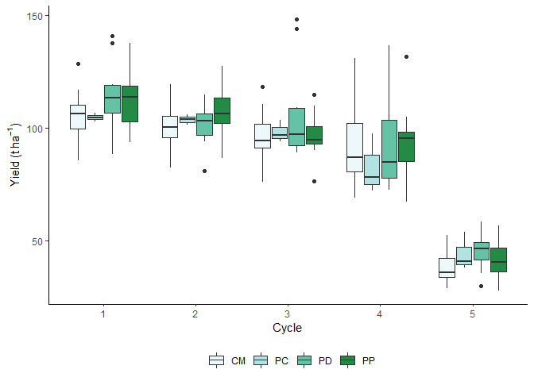
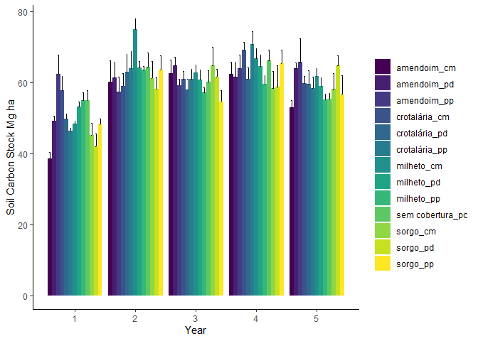
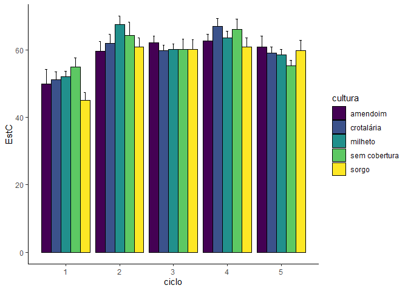
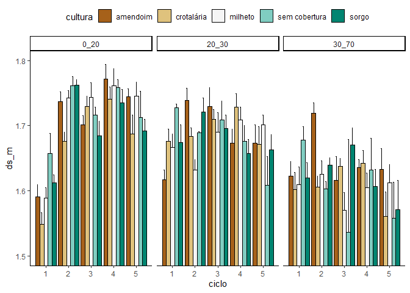
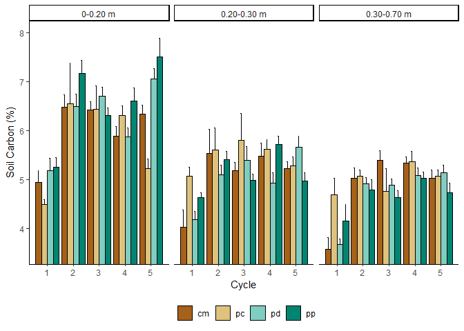
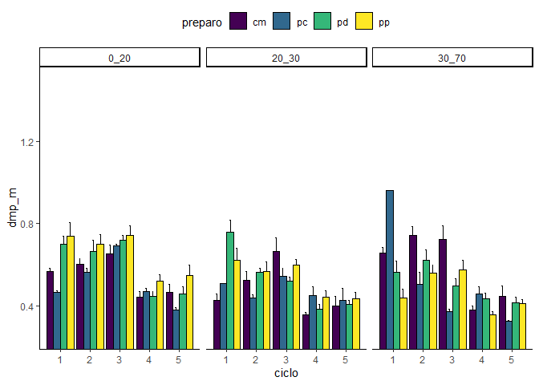
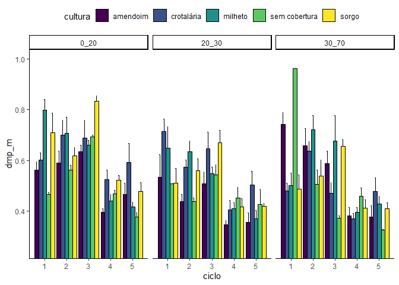
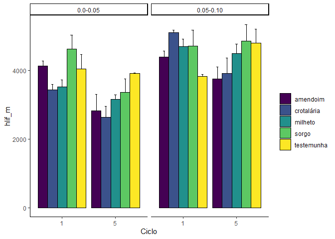
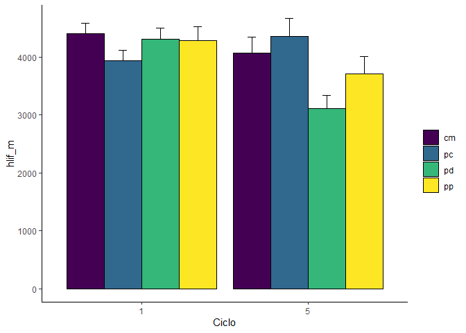

<!-- README.md is generated from README.Rmd. Please edit that file -->

# carbono-camila

``` r
library(tidyverse)
library(lubridate)
library(scales)
library(readxl)
library(patchwork)
library(hrbrthemes)
```

#### Gráfico de temperatura e umidade

``` r
clima <- read_excel("data/Dados_climáticos_completo_V2.xlsx",
                    sheet="Planilha1") %>% 
  janitor::clean_names() %>% 
  mutate(
    ano = as.numeric(ano),
    dia = as.numeric(dia),
    mes = as.numeric(mes),
    data = make_date(year=ano,day=dia,month=mes)
  )
```

``` r
coeff=9
a=1
Sys.setlocale("LC_ALL", "English")
#> [1] "LC_COLLATE=English_United States.1252;LC_CTYPE=English_United States.1252;LC_MONETARY=English_United States.1252;LC_NUMERIC=C;LC_TIME=English_United States.1252"
clima %>% filter(ano > 2014) %>% 
  mutate(month_year = make_date(year=ano, month= mes, day=1)) %>% 
  group_by(month_year) %>% 
  summarise(
    rain = sum(precipitacoa),
    tmedia = mean(tmedia),
    tmin =mean(tmin),
    tmax =mean(tmax),
  ) %>% 
  mutate(lg = "gray") %>% 
  ggplot(aes(x=month_year,y=rain,fill=lg)) +
  geom_col(color="black") +
  geom_line(aes(y = a + tmedia*coeff), color = "red") +
  scale_y_continuous(
    name = "Precipitation (mm)",
    sec.axis = sec_axis(~ (. - a)/coeff, name="Temperature (°C)"),
  ) +
    scale_x_date(name = "",date_breaks = "3 months",
              # date_labels = "%b",
              labels = label_date_short(format = c("%Y", "%b", NA, NA)),
              expand = c(0.005,0.005)
              )+
  theme_bw() +
  theme(legend.title = element_text(size=1),
        legend.position = "top") +
  scale_fill_manual(name= NULL,
                    values = c(" Precipitation   " = "darkgrey",
                               " Temperature" = "red"))
```

<!-- --> tendencia de
queda

``` r
clima %>% filter(ano >= 2018) %>% 
  group_by(ano, mes) %>% 
  summarise(prec = sum(precipitacoa,na.rm=TRUE)) %>% 
  mutate(ano_mes = lubridate::make_date(ano,mes,1)) %>% 
#  group_by(ano) %>% 
#  summarise(prec = max(prec)) %>% 
  ggplot(aes(x=ano_mes, y=prec)) +
  geom_point()+
  geom_smooth(method="lm")
```

<!-- -->

``` r
da <- clima %>% filter(ano >= 2018) %>% 
  group_by(ano, mes) %>% 
  summarise(prec = sum(precipitacoa,na.rm=TRUE)) %>% 
  mutate(ano_mes = lubridate::make_date(ano,mes,1))

summary(lm(prec ~ ano_mes, data=da))
#> 
#> Call:
#> lm(formula = prec ~ ano_mes, data = da)
#> 
#> Residuals:
#>     Min      1Q  Median      3Q     Max 
#> -133.97  -62.87  -26.24   44.31  278.43 
#> 
#> Coefficients:
#>               Estimate Std. Error t value Pr(>|t|)
#> (Intercept) 1469.75671  956.81282   1.536    0.134
#> ano_mes       -0.07553    0.05296  -1.426    0.163
#> 
#> Residual standard error: 100.5 on 34 degrees of freedom
#> Multiple R-squared:  0.05644,    Adjusted R-squared:  0.02869 
#> F-statistic: 2.034 on 1 and 34 DF,  p-value: 0.1629
-0.07553*12
#> [1] -0.90636
```

#### Gráfico da Produção mostrando a semelhança entre os SPS

``` r
prod <- read_xlsx("data/Qualid.Industrial e prod. 1, 2 ,3,  4 e 5.xlsx") %>% 
  janitor::clean_names()
glimpse(prod)
#> Rows: 195
#> Columns: 13
#> $ colheita            <dbl> 1, 1, 1, 1, 1, 1, 1, 1, 1, 1, 1, 1, 1, 1, 1, 1, 1,~
#> $ planta_de_cobertura <chr> "Amendoim", "Amendoim", "Amendoim", "Amendoim", "A~
#> $ sps                 <chr> "PD", "PD", "PD", "CM", "CM", "CM", "PP", "PP", "P~
#> $ bloco               <chr> "B1", "B2", "B3", "B1", "B2", "B3", "B1", "B2", "B~
#> $ brix                <dbl> 21.39, 20.13, 21.25, 22.24, 22.08, 20.94, 21.48, 2~
#> $ pol                 <dbl> 18.220, 17.110, 18.120, 19.630, 18.660, 16.980, 18~
#> $ pureza              <dbl> 85.18, 85.00, 85.27, 88.26, 84.51, 81.09, 84.82, 8~
#> $ ar                  <dbl> 0.9112, 1.3560, 1.0885, 0.6916, 0.9997, 1.3221, 1.~
#> $ pc                  <dbl> 15.4173, 14.2291, 14.9944, 16.5005, 15.6563, 14.16~
#> $ fibra               <dbl> 12.04, 13.01, 13.35, 12.44, 12.51, 12.85, 11.74, 1~
#> $ ar_cana             <dbl> 0.77110, 1.12820, 0.90030, 0.58120, 0.83910, 1.103~
#> $ atr                 <dbl> 155.55, 147.37, 152.66, 164.24, 158.47, 146.49, 15~
#> $ producao            <dbl> 88.30000, 119.00000, 110.18519, 128.63704, 85.6592~
```

``` r
prod %>% 
  group_by(sps,colheita) %>% 
  summarise(
    prod_mean = mean(producao),
    n = n(),
    stde = sd(producao)/sqrt(n)
  ) %>% 
  ggplot(aes(x=colheita, y=prod_mean, fill=sps)) +
  geom_col(position="dodge",color="black") +
  scale_fill_viridis_d() +
  theme_classic()+
  geom_errorbar(aes(ymin=prod_mean, ymax=prod_mean+stde), width=.2,
                 position=position_dodge(.9))
```

<!-- -->

``` r
trat <- prod %>% pull(sps)
y <- prod %>% pull(producao)
bloco <- prod %>% pull(bloco)
ciclo <- prod %>% pull(colheita)

ExpDes.pt::psub2.dbc(trat,ciclo,bloco,y,fac.names = c("sps","ciclo"))
#> ------------------------------------------------------------------------
#> Legenda:
#> FATOR 1 (parcela):  sps 
#> FATOR 2 (subparcela):  ciclo 
#> ------------------------------------------------------------------------
#> 
#> ------------------------------------------------------------------------
#> Quadro da analise de variancia
#> ------------------------------------------------------------------------
#>            GL     SQ      QM      Fc Pr(>Fc)    
#> sps         3   1081   360.3   7.151 0.02088 *  
#> Bloco       2    355   177.4   3.520 0.09741 .  
#> Erro a      6    302    50.4                    
#> ciclo       4 115908 28977.1 157.145 < 2e-16 ***
#> sps*ciclo  12   1019    84.9   0.461 0.93497    
#> Erro b    167  30794   184.4                    
#> Total     194 149460                            
#> ---
#> Signif. codes:  0 '***' 0.001 '**' 0.01 '*' 0.05 '.' 0.1 ' ' 1
#> ------------------------------------------------------------------------
#> CV 1 = 7.942827 %
#> CV 2 = 15.19405 %
#> 
#> Interacao nao significativa: analisando os efeitos simples
#> ------------------------------------------------------------------------
#> sps
#> Teste de Tukey
#> ------------------------------------------------------------------------
#> Grupos Tratamentos Medias
#> a     PD      92.23708 
#> a     PP      89.94942 
#> a     PC      86.70204 
#> a     CM      86.59843 
#> ------------------------------------------------------------------------
#> 
#> ciclo
#> Teste de Tukey
#> ------------------------------------------------------------------------
#> Grupos Tratamentos Medias
#> a     1   110.1139 
#> ab    2   103.2499 
#>  bc   3   99.19354 
#>   c   4   92.30509 
#>    d      5   41.9998 
#> ------------------------------------------------------------------------
```

### Boxplot para estudo de possíveis *outliers*

``` r
prod %>% 
  group_by(sps, colheita) %>% 
  ggplot(aes(x=as_factor(colheita), y=producao, fill=sps)) +
  geom_boxplot() +
  # facet_wrap(~sps)+
  # scale_fill_viridis_d() +
  scale_fill_brewer(
    type = "seq",
    palette = 2,
    direction = 1,
    aesthetics = "fill"
  ) +
  theme_classic() +
  labs(x="Cycle", y=expression(paste("Yield (t ",ha^{-1},")")),
       fill = "") +
  theme(legend.position = "bottom")
```

<!-- -->

``` r
prod %>% 
  group_by(sps, colheita) %>% 
  ggplot(aes(x=producao, fill=sps)) +
  geom_density(alpha=.5) +
  facet_wrap(~colheita,ncol=3)+
  scale_fill_viridis_d() +
  theme_classic()+
  theme(legend.position = "bottom")+
  labs(fill="")
```

<!-- -->

#### Estoque de Carbono Pastagem

``` r
estCpasto <- read_excel("data/estoque-pasto1.xlsx", na = "NA") %>% 
  janitor::clean_names()
glimpse(estCpasto)
#> Rows: 1,965
#> Columns: 12
#> $ ciclo               <dbl> 0, 0, 0, 0, 0, 0, 0, 0, 0, 0, 0, 0, 0, 0, 0, 1, 1,~
#> $ planta_de_cobertura <chr> "Pasto", "Pasto", "Pasto", "Pasto", "Pasto", "Past~
#> $ sps                 <chr> "pasto", "pasto", "pasto", "pasto", "pasto", "past~
#> $ linha_entrelinha    <chr> NA, NA, NA, NA, NA, NA, NA, NA, NA, NA, NA, NA, NA~
#> $ profundidade        <chr> "00 - 10", "00 - 10", "00 - 10", "10 - 20", "10 - ~
#> $ bloco               <chr> "B1", "B2", "B3", "B1", "B2", "B3", "B1", "B2", "B~
#> $ ds_kg_dm_3          <dbl> 1.600900, 1.497017, 1.561022, 1.611942, 1.616334, ~
#> $ c_g_kg_1            <dbl> 8.8040, 8.9620, 8.7190, 6.6870, 6.4580, 5.9840, 4.~
#> $ espessura_cm        <dbl> NA, NA, NA, NA, NA, NA, NA, NA, NA, NA, NA, NA, NA~
#> $ estoque_c           <dbl> 10.000000, 10.000000, 10.000000, 10.000000, 10.000~
#> $ ds_referencia_cor   <dbl> NA, NA, NA, NA, NA, NA, NA, NA, NA, NA, NA, NA, NA~
#> $ estoque_ccor        <dbl> 14.094322, 13.416266, 13.610551, 10.779059, 10.438~
```

``` r
estCpasto %>% 
  group_by(ciclo, planta_de_cobertura, sps, profundidade, bloco) %>% 
  summarise(
    EstC = mean(estoque_ccor,na.rm = TRUE)
    ) %>% 
 mutate(
   prof = case_when(
      profundidade == "00 - 10" ~ "A", 
      profundidade == "10 - 20" ~ "A",
      profundidade == "10 -20" ~ "A",
      profundidade == "0,0-0,05" ~ "A",
      profundidade == "0,05-0,10" ~ "A",
      profundidade == "0,10-0,20" ~ "A",
      profundidade == "20 - 30" ~ "AB",
      profundidade == "0,20-0,30" ~ "AB",
      profundidade == "30 - 60" ~ "Bt",
      profundidade == "0,30-0,70" ~ "Bt"
    )
  ) %>% 
  group_by(ciclo, planta_de_cobertura, sps, bloco, prof) %>% 
  summarise(EstC_s = sum(EstC,na.rm = TRUE)) %>% 
  mutate(
    EstC_s = ifelse(ciclo == 0 & prof == "Bt", EstC_s+5.83, EstC_s),
    ciclo = case_when(ciclo == 0 ~ "Pasture",
                      ciclo == 1 ~ "2015/16",
                      ciclo == 2 ~ "2016/17",
                      ciclo == 3 ~ "2017/18",
                      ciclo == 4 ~ "2018/19",
                      ciclo == 5 ~ "2019/20") %>% as_factor() 
  ) %>% drop_na() %>% 
  group_by(ciclo, prof) %>% 
  summarise(
    EstC_m = mean(EstC_s),
    n=n(),
    stde = sd(EstC_s)/n^.5
  ) %>% 
  ggplot(aes(x=ciclo, y=EstC_m, fill=prof)) +
  geom_col(position="dodge",color="black") + 
    # scale_fill_viridis_d() +
    scale_fill_brewer(
    palette = "YlOrBr"
  ) +
  theme_classic()+
  geom_errorbar(aes(ymin=EstC_m, ymax=EstC_m+stde), width=.2,
                 position=position_dodge(.9)) +
  labs(x="Use | Year", 
       y=expression(paste("Soil Carbon Stock (Mg  ", ha^-1,")")), 
       fill = "Horizon")+
    theme(legend.position = "bottom") +
  geom_vline(xintercept = 1.5, lty=2, color="black", size=.7)
```

<!-- -->

``` r
(21.32+20.75+20.16+19.10)/4
#> [1] 20.3325
( 31.35589 + 
 30.48601 + 
 30.40861 + 
 30.08013 )/4
#> [1] 30.58266
26.99837 -   24.19837 
#> [1] 2.8
```

``` r
my_df <- estCpasto %>% 
  group_by(ciclo, planta_de_cobertura, sps, profundidade, bloco) %>% 
  summarise(
    EstC = mean(estoque_ccor,na.rm = TRUE)
    ) %>% 
 mutate(
   prof = case_when(
      profundidade == "00 - 10" ~ "A", 
      profundidade == "10 - 20" ~ "A",
      profundidade == "10 -20" ~ "A",
      profundidade == "0,0-0,05" ~ "A",
      profundidade == "0,05-0,10" ~ "A",
      profundidade == "0,10-0,20" ~ "A",
      profundidade == "20 - 30" ~ "AB",
      profundidade == "0,20-0,30" ~ "AB",
      profundidade == "30 - 60" ~ "Bt",
      profundidade == "0,30-0,70" ~ "Bt"
    )
  ) %>% 
  group_by(ciclo, planta_de_cobertura, sps, bloco, prof) %>% 
  summarise(EstC_s = sum(EstC,na.rm = TRUE)) %>% 
  mutate(
    EstC_s = ifelse(ciclo == 0 & prof == "Bt", EstC_s+5.83, EstC_s),
    ciclo = case_when(ciclo == 0 ~ "Pasture",
                      ciclo == 1 ~ "2015/16",
                      ciclo == 2 ~ "2016/17",
                      ciclo == 3 ~ "2017/18",
                      ciclo == 4 ~ "2018/19",
                      ciclo == 5 ~ "2019/20") %>% as_factor() 
  ) %>% drop_na() %>% 
  group_by(ciclo, prof, bloco) %>% 
  summarise(
    EstC_m = mean(EstC_s),
    n=n(),
    stde = sd(EstC_s)/n^.5
  )
glimpse(my_df)
#> Rows: 54
#> Columns: 6
#> Groups: ciclo, prof [18]
#> $ ciclo  <fct> Pasture, Pasture, Pasture, Pasture, Pasture, Pasture, Pasture, ~
#> $ prof   <chr> "A", "A", "A", "AB", "AB", "AB", "Bt", "Bt", "Bt", "A", "A", "A~
#> $ bloco  <chr> "B1", "B2", "B3", "B1", "B2", "B3", "B1", "B2", "B3", "B1", "B2~
#> $ EstC_m <dbl> 24.873381, 23.854547, 23.244791, 7.841236, 9.561568, 9.596154, ~
#> $ n      <int> 1, 1, 1, 1, 1, 1, 1, 1, 1, 13, 13, 13, 13, 13, 13, 13, 13, 13, ~
#> $ stde   <dbl> NA, NA, NA, NA, NA, NA, NA, NA, NA, 0.5352421, 0.7975150, 0.471~

prof <- my_df %>% pull(prof)
ciclo <- my_df %>% pull(ciclo)
bloco <- my_df %>% pull(bloco)
y <- my_df %>% pull(EstC_m)

ExpDes.pt::psub2.dbc(prof,ciclo,bloco,y,
                     fac.names = c("prof","ciclo"))
#> ------------------------------------------------------------------------
#> Legenda:
#> FATOR 1 (parcela):  prof 
#> FATOR 2 (subparcela):  ciclo 
#> ------------------------------------------------------------------------
#> 
#> ------------------------------------------------------------------------
#> Quadro da analise de variancia
#> ------------------------------------------------------------------------
#>            GL     SQ      QM     Fc Pr(>Fc)    
#> prof        2 3739.9 1869.94 5261.6  <2e-16 ***
#> Bloco       2    1.6    0.82    2.3  0.2169    
#> Erro a      4    1.4    0.36                   
#> ciclo       5  138.1   27.63   29.2  <2e-16 ***
#> prof*ciclo 10  100.5   10.05   10.6  <2e-16 ***
#> Erro b     30   28.4    0.95                   
#> Total      53 4010.0                           
#> ---
#> Signif. codes:  0 '***' 0.001 '**' 0.01 '*' 0.05 '.' 0.1 ' ' 1
#> ------------------------------------------------------------------------
#> CV 1 = 3.101982 %
#> CV 2 = 5.065258 %
#> 
#> 
#> 
#> Interacao significativa: desdobrando a interacao
#> ------------------------------------------------------------------------
#> 
#> Desdobrando  prof  dentro de cada nivel de  ciclo 
#> ------------------------------------------------------------------------
#>                             GL        SQ         QM         Fc valor.p
#> prof : ciclo Pasture   2.00000 557.73651 278.868253  328.49936       0
#> prof : ciclo 2015/16   2.00000 429.76418 214.882092  253.12537       0
#> prof : ciclo 2016/17   2.00000 699.79552 349.897759 412.170222       0
#> prof : ciclo 2017/18   2.00000 712.36982 356.184910 419.576319       0
#> prof : ciclo 2018/19   2.00000 753.88771 376.943855 444.029802       0
#> prof : ciclo 2019/20   2.00000 686.81541 343.407705 404.525112       0
#> Erro combinado        33.26557  28.23967   0.848916                   
#> ------------------------------------------------------------------------
#> 
#> 
#>  prof dentro de ciclo Pasture
#> ------------------------------------------------------------------------
#> Teste de Tukey
#> ------------------------------------------------------------------------
#> Grupos Tratamentos Medias
#> a     Bt      26.99837 
#>  b    A   23.99091 
#>   c   AB      8.999653 
#> ------------------------------------------------------------------------
#> 
#>  prof dentro de ciclo 2015/16
#> ------------------------------------------------------------------------
#> Teste de Tukey
#> ------------------------------------------------------------------------
#> Grupos Tratamentos Medias
#> a     Bt      24.19837 
#>  b    A   15.475 
#>   c   AB      7.274471 
#> ------------------------------------------------------------------------
#> 
#>  prof dentro de ciclo 2016/17
#> ------------------------------------------------------------------------
#> Teste de Tukey
#> ------------------------------------------------------------------------
#> Grupos Tratamentos Medias
#> a     Bt      30.40861 
#>  b    A   20.75221 
#>   c   AB      8.848311 
#> ------------------------------------------------------------------------
#> 
#>  prof dentro de ciclo 2017/18
#> ------------------------------------------------------------------------
#> Teste de Tukey
#> ------------------------------------------------------------------------
#> Grupos Tratamentos Medias
#> a     Bt      30.48601 
#>  b    A   20.16401 
#>   c   AB      8.703423 
#> ------------------------------------------------------------------------
#> 
#>  prof dentro de ciclo 2018/19
#> ------------------------------------------------------------------------
#> Teste de Tukey
#> ------------------------------------------------------------------------
#> Grupos Tratamentos Medias
#> a     Bt      31.35589 
#>  b    A   19.10359 
#>   c   AB      8.970746 
#> ------------------------------------------------------------------------
#> 
#>  prof dentro de ciclo 2019/20
#> ------------------------------------------------------------------------
#> Teste de Tukey
#> ------------------------------------------------------------------------
#> Grupos Tratamentos Medias
#> a     Bt      30.08013 
#>  b    A   21.32657 
#>   c   AB      8.793616 
#> ------------------------------------------------------------------------
#> 
#> 
#> Desdobrando  ciclo  dentro de cada nivel de  prof 
#> ------------------------------------------------------------------------
#>                  GL         SQ        QM       Fc  valor.p
#> ciclo : prof A    5 118.347172 23.669434 24.97777        0
#> ciclo : prof AB   5   6.492083  1.298417 1.370187 0.263302
#> ciclo : prof Bt   5 113.802671 22.760534 24.01863        0
#> Erro b           30  28.428601  0.947620                  
#> ------------------------------------------------------------------------
#> 
#> 
#>  ciclo dentro de prof A
#> ------------------------------------------------------------------------
#> Teste de Tukey
#> ------------------------------------------------------------------------
#> Grupos Tratamentos Medias
#> a     Pasture     23.99091 
#>  b    2019/20     21.32657 
#>  b    2016/17     20.75221 
#>  b    2017/18     20.16401 
#>  b    2018/19     19.10359 
#>   c   2015/16     15.475 
#> ------------------------------------------------------------------------
#> ------------------------------------------------------------------------
#> 
#> 
#>  ciclo dentro de prof AB
#> ------------------------------------------------------------------------
#> De acordo com o teste F, as medias desse fator sao estatisticamente iguais.
#> ------------------------------------------------------------------------
#>    Niveis   Medias
#> 1 2015/16 7.274471
#> 2 2016/17 8.848311
#> 3 2017/18 8.703423
#> 4 2018/19 8.970746
#> 5 2019/20 8.793616
#> 6 Pasture 8.999653
#> ------------------------------------------------------------------------
#> 
#>  ciclo dentro de prof Bt
#> ------------------------------------------------------------------------
#> Teste de Tukey
#> ------------------------------------------------------------------------
#> Grupos Tratamentos Medias
#> a     2018/19     31.35589 
#> a     2017/18     30.48601 
#> a     2016/17     30.40861 
#> a     2019/20     30.08013 
#>  b    Pasture     26.99837 
#>   c   2015/16     24.19837 
#> ------------------------------------------------------------------------
#> ------------------------------------------------------------------------
```

``` r
(66.23907 +
64.40943 +
60.2368 )/3
#> [1] 63.62843
66.23907- 55.44922 
#> [1] 10.78985

48.50428 - 61.71686 
#> [1] -13.21258
```

#### estoque de carbono, mostrar ao longo do tempo em função do sistema de preparo e depois pelo sistema de cobertura

``` r
atributos <- read_xlsx("data/Dados Gerais.xlsx") %>% 
  janitor::clean_names()
atributos <- atributos %>% 
  mutate(
    cultura = str_remove(str_extract(tratamento, ".*_"),"_")
  )
glimpse(atributos)
#> Rows: 585
#> Columns: 22
#> $ ciclo            <dbl> 1, 1, 1, 1, 1, 1, 1, 1, 1, 1, 1, 1, 1, 1, 1, 1, 1, 1,~
#> $ tratamento       <chr> "amendoim_pd", "amendoim_pd", "amendoim_pd", "amendoi~
#> $ cultura          <chr> "amendoim", "amendoim", "amendoim", "amendoim", "amen~
#> $ preparo          <chr> "pd", "pd", "pd", "pd", "pd", "pd", "pd", "pd", "pd",~
#> $ linha_entrelinha <chr> "Média_ponderada", "Média_ponderada", "Média_ponderad~
#> $ profundidade     <chr> "0_20", "0_20", "0_20", "20_30", "20_30", "20_30", "3~
#> $ bloco            <chr> "b1", "b2", "b3", "b1", "b2", "b3", "b1", "b2", "b3",~
#> $ ds               <dbl> 1.541851, 1.656825, 1.490723, 1.663634, 1.663012, 1.6~
#> $ macro            <dbl> 0.22259881, 0.15329831, 0.19500683, 0.14215579, 0.144~
#> $ micro            <dbl> 0.2045018, 0.2310544, 0.2080318, 0.2416834, 0.2400504~
#> $ pt               <dbl> 0.4271007, 0.3843528, 0.4030386, 0.3838392, 0.3840695~
#> $ dp               <dbl> 2.69, 2.69, 2.69, 2.70, 2.70, 2.70, 2.69, 2.69, 2.69,~
#> $ rp               <dbl> 1.0076667, 1.0002333, 0.9988667, 1.4013000, 1.9214000~
#> $ dmp              <dbl> 0.7394362, 0.6215094, 0.6568675, 0.9229124, 0.9356794~
#> $ p_resina         <dbl> 3.198333, 3.531667, 2.910000, 1.000000, 1.730000, 1.0~
#> $ p_h              <dbl> 5.103500, 5.436167, 5.270333, 4.254000, 4.700000, 4.9~
#> $ k                <dbl> 0.7126667, 0.7558333, 0.6550000, 0.2000000, 0.3270000~
#> $ ca               <dbl> 14.573333, 15.406667, 14.370000, 12.460000, 9.540000,~
#> $ mg               <dbl> 7.509167, 7.171667, 7.846667, 4.365000, 4.405000, 5.5~
#> $ h_al             <dbl> 17.41333, 16.43167, 17.45000, 25.00000, 20.67500, 23.~
#> $ c                <dbl> 4.712640, 5.443577, 4.704227, 4.002810, 5.348700, 4.6~
#> $ est_c            <dbl> 15.492918, 17.443401, 15.559664, 6.941640, 9.261756, ~
```

``` r
atributos %>% 
  group_by(ciclo,preparo,profundidade) %>% 
  summarise(EstC = mean(est_c),
            n = n(),
            stde = sd(est_c)/sqrt(n)
            ) %>% 
  group_by(ciclo, preparo) %>% 
  summarise(EstC = sum(EstC),
            stde = sum(stde)
            )  %>% 
  ggplot(aes(x=ciclo, y=EstC, fill=preparo)) +
  geom_col(position="dodge", color="black") +
  scale_fill_viridis_d() +
  theme_classic()+
  geom_errorbar(aes(ymin=EstC, ymax=EstC+stde), width=.2,
                 position=position_dodge(.9)) +
  labs(x="Year", 
       y=expression(paste("Soil Carbon Stock (Mg  ", ha^-1,")")), 
       fill = "") +
  theme(legend.position = "bottom")
```

<!-- -->

``` r
atributos %>% 
  group_by(ciclo,profundidade) %>% 
  summarise(EstC = mean(est_c),
            n = n(),
            stde = sd(est_c)/sqrt(n)
            ) %>% 
  # group_by(ciclo, preparo) %>% 
  # summarise(EstC = sum(EstC),
  #           stde = sum(stde)
  #           )  %>% 
  ggplot(aes(x=ciclo, y=EstC, color=profundidade,
             shape=profundidade)) +
  #geom_col(position="dodge", color="black") +
  #scale_fill_viridis_d() +
  geom_line() +
  geom_point() + 
  theme_classic()+
  # geom_errorbar(aes(ymin=EstC, ymax=EstC+stde), width=.2,
  #                position=position_dodge(.9)) +
  labs(x="Year", 
       y=expression(paste("Soil Carbon Stock (Mg  ", ha^-1,")")), 
       fill = "")
```

<!-- -->

``` r
atrr <- atributos %>% 
  group_by(ciclo,cultura,preparo,bloco) %>% 
  summarise(est_c=sum(est_c))
```

``` r
trat <- atrr %>% pull(preparo)
y <- atrr %>% pull(est_c)
bloco <- atrr %>% pull(bloco)
ciclo <- atrr %>% pull(ciclo)

ExpDes.pt::psub2.dbc(trat,ciclo,bloco,y,fac.names = c("sps","ciclo"),
                     sigF = 0.1, sigT=0.15)
#> ------------------------------------------------------------------------
#> Legenda:
#> FATOR 1 (parcela):  sps 
#> FATOR 2 (subparcela):  ciclo 
#> ------------------------------------------------------------------------
#> 
#> ------------------------------------------------------------------------
#> Quadro da analise de variancia
#> ------------------------------------------------------------------------
#>            GL      SQ      QM     Fc Pr(>Fc)    
#> sps         3    22.1    7.35  0.519 0.68484    
#> Bloco       2   207.8  103.91  7.329 0.02450 *  
#> Erro a      6    85.1   14.18                   
#> ciclo       4  4631.7 1157.92 33.884 < 2e-16 ***
#> sps*ciclo  12   684.7   57.06  1.670 0.07759 .  
#> Erro b    167  5707.0   34.17                   
#> Total     194 11338.3                           
#> ---
#> Signif. codes:  0 '***' 0.001 '**' 0.01 '*' 0.05 '.' 0.1 ' ' 1
#> ------------------------------------------------------------------------
#> CV 1 = 6.348454 %
#> CV 2 = 9.855928 %
#> 
#> 
#> 
#> Interacao significativa: desdobrando a interacao
#> ------------------------------------------------------------------------
#> 
#> Desdobrando  sps  dentro de cada nivel de  ciclo 
#> ------------------------------------------------------------------------
#>                      GL        SQ         QM         Fc valor.p
#> sps : ciclo 1    3.0000 11805.052 3935.01745  130.40876       0
#> sps : ciclo 2    3.0000 19477.316 6492.43876 215.163185       0
#> sps : ciclo 3    3.0000 18856.908 6285.63595 208.309619       0
#> sps : ciclo 4    3.0000 19970.967 6656.98907 220.616477       0
#> sps : ciclo 5    3.0000 18990.472 6330.15720  209.78508       0
#> Erro combinado 156.5588  4724.082   30.17449                   
#> ------------------------------------------------------------------------
#> 
#> 
#>  sps dentro de ciclo 1
#> ------------------------------------------------------------------------
#> Teste de Tukey
#> ------------------------------------------------------------------------
#> Grupos Tratamentos Medias
#> a     pc      55.0253 
#> ab    pp      52.98847 
#>  b    pd      48.50428 
#>  b    cm      47.47354 
#> ------------------------------------------------------------------------
#> 
#>  sps dentro de ciclo 2
#> ------------------------------------------------------------------------
#> Teste de Tukey
#> ------------------------------------------------------------------------
#> Grupos Tratamentos Medias
#> a     pc      64.40943 
#> a     cm      63.85286 
#> a     pp      62.19025 
#> a     pd      61.71686 
#> ------------------------------------------------------------------------
#> 
#>  sps dentro de ciclo 3
#> ------------------------------------------------------------------------
#> Teste de Tukey
#> ------------------------------------------------------------------------
#> Grupos Tratamentos Medias
#> a     cm      62.77387 
#> a     pd      61.24308 
#> a     pc      60.2368 
#> a     pp      57.94881 
#> ------------------------------------------------------------------------
#> 
#>  sps dentro de ciclo 4
#> ------------------------------------------------------------------------
#> Teste de Tukey
#> ------------------------------------------------------------------------
#> Grupos Tratamentos Medias
#> a     pc      66.23907 
#> a     pp      64.97264 
#> a     cm      64.23296 
#> a     pd      61.50966 
#> ------------------------------------------------------------------------
#> 
#>  sps dentro de ciclo 5
#> ------------------------------------------------------------------------
#> Teste de Tukey
#> ------------------------------------------------------------------------
#> Grupos Tratamentos Medias
#> a     pd      61.82296 
#> ab    pp      59.02697 
#> ab    cm      58.2329 
#>  b    pc      55.44922 
#> ------------------------------------------------------------------------
#> 
#> 
#> Desdobrando  ciclo  dentro de cada nivel de  sps 
#> ------------------------------------------------------------------------
#>                  GL        SQ        QM        Fc  valor.p
#> ciclo : sps cm    4 2377.6000 594.40000 17.393602        0
#> ciclo : sps pc    4  310.5373  77.63433  2.271771 0.063621
#> ciclo : sps pd    4 1641.9851 410.49628 12.012128        0
#> ciclo : sps pp    4  986.2729 246.56822  7.215191  2.2e-05
#> Erro b          167 5706.9720  34.17348                   
#> ------------------------------------------------------------------------
#> 
#> 
#>  ciclo dentro de sps cm
#> ------------------------------------------------------------------------
#> Teste de Tukey
#> ------------------------------------------------------------------------
#> Grupos Tratamentos Medias
#> a     4   64.23296 
#> a     2   63.85286 
#> ab    3   62.77387 
#>  b    5   58.2329 
#>   c   1   47.47354 
#> ------------------------------------------------------------------------
#> ------------------------------------------------------------------------
#> 
#> 
#>  ciclo dentro de sps pc
#> ------------------------------------------------------------------------
#> Teste de Tukey
#> ------------------------------------------------------------------------
#> Grupos Tratamentos Medias
#> a     4   66.23907 
#> ab    2   64.40943 
#> ab    3   60.2368 
#> ab    5   55.44922 
#>  b    1   55.0253 
#> ------------------------------------------------------------------------
#> ------------------------------------------------------------------------
#> 
#> 
#>  ciclo dentro de sps pd
#> ------------------------------------------------------------------------
#> Teste de Tukey
#> ------------------------------------------------------------------------
#> Grupos Tratamentos Medias
#> a     5   61.82296 
#> a     2   61.71686 
#> a     4   61.50966 
#> a     3   61.24308 
#>  b    1   48.50428 
#> ------------------------------------------------------------------------
#> ------------------------------------------------------------------------
#> 
#> 
#>  ciclo dentro de sps pp
#> ------------------------------------------------------------------------
#> Teste de Tukey
#> ------------------------------------------------------------------------
#> Grupos Tratamentos Medias
#> a     4   64.97264 
#> ab    2   62.19025 
#>  b    5   59.02697 
#>  bc   3   57.94881 
#>   c   1   52.98847 
#> ------------------------------------------------------------------------
#> ------------------------------------------------------------------------
```

``` r
atributos %>% 
  group_by(ciclo,tratamento,profundidade) %>% 
  summarise(EstC = mean(est_c),
            n = n(),
            stde = sd(est_c)/sqrt(n)
            ) %>% 
  group_by(ciclo, tratamento) %>% 
  summarise(EstC = sum(EstC),
            stde = sum(stde)
            )  %>% 
  ggplot(aes(x=ciclo, y=EstC, fill=tratamento)) +
  geom_col(position="dodge") +
  scale_fill_viridis_d() +
  theme_classic()+
  geom_errorbar(aes(ymin=EstC, ymax=EstC+stde), width=.2,
                 position=position_dodge(.9)) +
  labs(x="Year", y="Soil Carbon Stock Mg ha", fill = "")
```

<!-- -->

``` r
atributos %>% 
  group_by(ciclo,cultura, preparo,profundidade) %>% 
  summarise(EstC = mean(est_c),
            n = n(),
            stde = sd(est_c)/sqrt(n)
            ) %>% 
  group_by(ciclo, preparo, cultura) %>% 
  summarise(EstC = sum(EstC),
            stde = sum(stde)
            )  %>% 
  ggplot(aes(x=ciclo, y=EstC, fill=preparo)) +
  geom_col(position="dodge") +
  scale_fill_viridis_d() +
  theme_classic()+
  facet_wrap(~cultura) +
  geom_errorbar(aes(ymin=EstC, ymax=EstC+stde), width=.2,
                 position=position_dodge(.9)) +
  labs(x="Year", y="Soil Carbon Stock Mg ha", fill = "")
```

<!-- -->

``` r
atributos %>% 
  group_by(ciclo,cultura,profundidade) %>% 
  summarise(EstC = mean(est_c),
            n = n(),
            stde = sd(est_c)/sqrt(n)
            ) %>% 
  group_by(ciclo, cultura) %>% 
  summarise(EstC = sum(EstC),
            stde = sum(stde)
            )  %>% 
  ggplot(aes(x=ciclo, y=EstC, fill=cultura)) +
  geom_col(position="dodge", color="black") +
  scale_fill_viridis_d() +
  theme_classic()+
  geom_errorbar(aes(ymin=EstC, ymax=EstC+stde), width=.2,
                 position=position_dodge(.9))
```

<!-- --> \####
densidade do solo/ carbono orgânico/ e possivelmente DMP

``` r
atributos %>% 
  mutate(profundidade = case_when(
    profundidade == "0_20" ~ "0-0.20 m",
    profundidade == "20_30" ~ "0.20-0.30 m",
    profundidade == "30_70" ~ "0.30-0.70 m",
  )) %>% 
  group_by(ciclo,preparo,profundidade) %>% 
  summarise(ds_m = mean(ds),
            n = n(),
            stde = sd(ds)/sqrt(n)
            ) %>% 
  group_by(ciclo, preparo) %>% 
  # summarise(ds_m = mean(ds_m),
  #           stde = mean(stde)
  #           )  %>% 
  ggplot(aes(x=ciclo, y=ds_m, fill=preparo)) +
  geom_col(positio = "dodge", color="black") +
  scale_fill_brewer(
    type="seq",
    palette = 1
  )  +
  facet_wrap(~profundidade,nrow=1) +
  theme_classic()+
  geom_errorbar(aes(ymin=ds_m, ymax=ds_m+stde), width=.2,
                 position=position_dodge(.9)) +
  coord_cartesian(ylim=c(1.5,1.8)) +
  labs(x="Cycle", y=expression(paste("Bulk Density (g  ",cm^{-3},")")),
       fill="")+
  theme(legend.position = "bottom")
```

<!-- -->

``` r
atrr <- atributos %>% filter(profundidade == "30_70") %>% 
  group_by(ciclo,cultura,preparo,bloco) %>% 
  summarise(ds=mean(ds))
```

``` r
trat <- atrr %>% pull(preparo)
y <- atrr %>% pull(ds)
bloco <- atrr %>% pull(bloco)
ciclo <- atrr %>% pull(ciclo)

ExpDes.pt::psub2.dbc(trat,ciclo,bloco,y,fac.names = c("sps","ciclo"),sigF = .15,sigT=.15,mcomp = "tukey")
#> ------------------------------------------------------------------------
#> Legenda:
#> FATOR 1 (parcela):  sps 
#> FATOR 2 (subparcela):  ciclo 
#> ------------------------------------------------------------------------
#> 
#> ------------------------------------------------------------------------
#> Quadro da analise de variancia
#> ------------------------------------------------------------------------
#>            GL      SQ       QM     Fc Pr(>Fc)  
#> sps         3 0.02644 0.008813 1.4058 0.32976  
#> Bloco       2 0.05629 0.028146 4.4896 0.06427 .
#> Erro a      6 0.03762 0.006269                 
#> ciclo       4 0.05442 0.013605 2.1071 0.08212 .
#> sps*ciclo  12 0.11776 0.009813 1.5198 0.12128  
#> Erro b    167 1.07826 0.006457                 
#> Total     194 1.37078                          
#> ---
#> Signif. codes:  0 '***' 0.001 '**' 0.01 '*' 0.05 '.' 0.1 ' ' 1
#> ------------------------------------------------------------------------
#> CV 1 = 4.891094 %
#> CV 2 = 4.963662 %
#> 
#> 
#> 
#> Interacao significativa: desdobrando a interacao
#> ------------------------------------------------------------------------
#> 
#> Desdobrando  sps  dentro de cada nivel de  ciclo 
#> ------------------------------------------------------------------------
#>                      GL         SQ       QM         Fc valor.p
#> sps : ciclo 1   3.00000 12.8519140 4.283971  667.34761       0
#> sps : ciclo 2   3.00000 13.9906560 4.663552 726.477878       0
#> sps : ciclo 3   3.00000 13.8277790 4.609260 718.020339       0
#> sps : ciclo 4   3.00000 13.2835100 4.427837 689.758641       0
#> sps : ciclo 5   3.00000 13.1344630 4.378154 682.019219       0
#> Erro combinado 97.70109  0.6271433 0.006419                   
#> ------------------------------------------------------------------------
#> 
#> 
#>  sps dentro de ciclo 1
#> ------------------------------------------------------------------------
#> Teste de Tukey
#> ------------------------------------------------------------------------
#> Grupos Tratamentos Medias
#> a     pc      1.677656 
#> ab    cm      1.630637 
#> ab    pd      1.629071 
#>  b    pp      1.580803 
#> ------------------------------------------------------------------------
#> 
#>  sps dentro de ciclo 2
#> ------------------------------------------------------------------------
#> Teste de Tukey
#> ------------------------------------------------------------------------
#> Grupos Tratamentos Medias
#> a     pp      1.662185 
#> a     pd      1.647518 
#> a     cm      1.632369 
#> a     pc      1.603168 
#> ------------------------------------------------------------------------
#> 
#>  sps dentro de ciclo 3
#> ------------------------------------------------------------------------
#> Teste de Tukey
#> ------------------------------------------------------------------------
#> Grupos Tratamentos Medias
#> a     pp      1.631747 
#> ab    cm      1.622811 
#> ab    pd      1.616019 
#>  b    pc      1.536275 
#> ------------------------------------------------------------------------
#> 
#>  sps dentro de ciclo 4
#> ------------------------------------------------------------------------
#> Teste de Tukey
#> ------------------------------------------------------------------------
#> Grupos Tratamentos Medias
#> a     pp      1.645497 
#> a     pc      1.632487 
#> a     pd      1.616574 
#> a     cm      1.605548 
#> ------------------------------------------------------------------------
#> 
#>  sps dentro de ciclo 5
#> ------------------------------------------------------------------------
#> Teste de Tukey
#> ------------------------------------------------------------------------
#> Grupos Tratamentos Medias
#> a     pp      1.644122 
#> ab    pd      1.599619 
#> ab    pc      1.557772 
#>  b    cm      1.53962 
#> ------------------------------------------------------------------------
#> 
#> 
#> Desdobrando  ciclo  dentro de cada nivel de  sps 
#> ------------------------------------------------------------------------
#>                  GL       SQ       QM       Fc  valor.p
#> ciclo : sps cm    4 0.071894 0.017974  2.78357 0.028388
#> ciclo : sps pc    4 0.038788 0.009697 1.501771 0.203926
#> ciclo : sps pd    4 0.015204 0.003801 0.588657 0.671296
#> ciclo : sps pp    4 0.046291 0.011573 1.792279 0.132686
#> Erro b          167 1.078259 0.006457                  
#> ------------------------------------------------------------------------
#> 
#> 
#>  ciclo dentro de sps cm
#> ------------------------------------------------------------------------
#> Teste de Tukey
#> ------------------------------------------------------------------------
#> Grupos Tratamentos Medias
#> a     2   1.632369 
#> a     1   1.630637 
#> a     3   1.622811 
#> ab    4   1.605548 
#>  b    5   1.53962 
#> ------------------------------------------------------------------------
#> ------------------------------------------------------------------------
#> 
#> 
#>  ciclo dentro de sps pc
#> ------------------------------------------------------------------------
#> De acordo com o teste F, as medias desse fator sao estatisticamente iguais.
#> ------------------------------------------------------------------------
#>   Niveis   Medias
#> 1      1 1.677656
#> 2      2 1.603168
#> 3      3 1.536275
#> 4      4 1.632487
#> 5      5 1.557772
#> ------------------------------------------------------------------------
#> 
#>  ciclo dentro de sps pd
#> ------------------------------------------------------------------------
#> De acordo com o teste F, as medias desse fator sao estatisticamente iguais.
#> ------------------------------------------------------------------------
#>   Niveis   Medias
#> 1      1 1.629071
#> 2      2 1.647518
#> 3      3 1.616019
#> 4      4 1.616574
#> 5      5 1.599619
#> ------------------------------------------------------------------------
#> 
#>  ciclo dentro de sps pp
#> ------------------------------------------------------------------------
#> Teste de Tukey
#> ------------------------------------------------------------------------
#> Grupos Tratamentos Medias
#> a     2   1.662185 
#> ab    4   1.645497 
#> ab    5   1.644122 
#> ab    3   1.631747 
#>  b    1   1.580803 
#> ------------------------------------------------------------------------
#> ------------------------------------------------------------------------
```

``` r
atributos %>% 
  group_by(ciclo,cultura,profundidade) %>% 
  summarise(ds_m = mean(ds),
            n = n(),
            stde = sd(ds)/sqrt(n)
            ) %>% 
  group_by(ciclo, cultura) %>% 
  # summarise(ds_m = mean(ds_m),
  #           stde = mean(stde)
  #           )  %>% 
  ggplot(aes(x=ciclo, y=ds_m, fill=cultura)) +
  geom_col(positio = "dodge", color="black") +
    scale_fill_brewer(
    type="div",
    palette = 1
  ) +
  facet_wrap(~profundidade,nrow=1) +
  theme_classic()+
  geom_errorbar(aes(ymin=ds_m, ymax=ds_m+stde), width=.2,
                 position=position_dodge(.9)) +
  coord_cartesian(ylim=c(1.5,1.8))+
  theme(legend.position = "top")
```

<!-- -->

``` r
atributos %>% 
  mutate(profundidade = case_when(
    profundidade == "0_20" ~ "0-0.20 m",
    profundidade == "20_30" ~ "0.20-0.30 m",
    profundidade == "30_70" ~ "0.30-0.70 m",
  )) %>% 
  group_by(ciclo,preparo,profundidade) %>% 
  summarise(c_m = mean(c),
            n = n(),
            stde = sd(c)/sqrt(n)
            ) %>% 
  group_by(ciclo, preparo) %>% 
  # summarise(ds_m = mean(ds_m),
  #           stde = mean(stde)
  #           )  %>% 
  ggplot(aes(x=ciclo, y=c_m, fill=preparo)) +
  geom_col(positio = "dodge", color="black") +
    scale_fill_brewer(
    type="div") + 
  facet_wrap(~profundidade,nrow=1) +
  theme_classic()+
  geom_errorbar(aes(ymin=c_m, ymax=c_m+stde), width=.2,
                 position=position_dodge(.9)) +
  coord_cartesian(ylim=c(3.5,8))+
  labs(x="Cycle", y=expression(paste("Soil Carbon (%)")),
       fill="")+
  theme(legend.position = "bottom")
```

<!-- -->

``` r
atrr <- atributos %>% filter(profundidade == "30_70") %>%  
  group_by(ciclo,cultura,preparo,bloco) %>% 
  summarise(c=sum(c))
```

``` r
trat <- atrr %>% pull(preparo)
y <- atrr %>% pull(c)
bloco <- atrr %>% pull(bloco)
ciclo <- atrr %>% pull(ciclo)

ExpDes.pt::psub2.dbc(trat,ciclo,bloco,y,fac.names = c("sps","ciclo"),sigF=0.15,sigT=0.15)
#> ------------------------------------------------------------------------
#> Legenda:
#> FATOR 1 (parcela):  sps 
#> FATOR 2 (subparcela):  ciclo 
#> ------------------------------------------------------------------------
#> 
#> ------------------------------------------------------------------------
#> Quadro da analise de variancia
#> ------------------------------------------------------------------------
#>            GL      SQ      QM      Fc Pr(>Fc)    
#> sps         3   2.047  0.6823 10.4765 0.00845 ** 
#> Bloco       2   0.816  0.4081  6.2663 0.03393 *  
#> Erro a      6   0.391  0.0651                    
#> ciclo       4  41.230 10.3076 25.0730 < 2e-16 ***
#> sps*ciclo  12   8.349  0.6957  1.6923 0.07238 .  
#> Erro b    167  68.654  0.4111                    
#> Total     194 121.487                            
#> ---
#> Signif. codes:  0 '***' 0.001 '**' 0.01 '*' 0.05 '.' 0.1 ' ' 1
#> ------------------------------------------------------------------------
#> CV 1 = 5.341422 %
#> CV 2 = 13.42028 %
#> 
#> 
#> 
#> Interacao significativa: desdobrando a interacao
#> ------------------------------------------------------------------------
#> 
#> Desdobrando  sps  dentro de cada nivel de  ciclo 
#> ------------------------------------------------------------------------
#>                      GL        SQ        QM         Fc valor.p
#> sps : ciclo 1    3.0000  64.57932 21.526442  62.960043       0
#> sps : ciclo 2    3.0000 119.54543 39.848476  116.54791       0
#> sps : ciclo 3    3.0000 132.15804 44.052679 128.844266       0
#> sps : ciclo 4    3.0000 131.28082 43.760273 127.989044       0
#> sps : ciclo 5    3.0000 124.00334 41.334447 120.894042       0
#> Erro combinado 172.9398  59.12917  0.341906                   
#> ------------------------------------------------------------------------
#> 
#> 
#>  sps dentro de ciclo 1
#> ------------------------------------------------------------------------
#> Teste de Tukey
#> ------------------------------------------------------------------------
#> Grupos Tratamentos Medias
#> a     pc      4.69659 
#> ab    pp      4.155583 
#>  b    pd      3.676862 
#>  b    cm      3.584576 
#> ------------------------------------------------------------------------
#> 
#>  sps dentro de ciclo 2
#> ------------------------------------------------------------------------
#> Teste de Tukey
#> ------------------------------------------------------------------------
#> Grupos Tratamentos Medias
#> a     pc      5.07438 
#> a     cm      5.027619 
#> a     pd      4.910079 
#> a     pp      4.785695 
#> ------------------------------------------------------------------------
#> 
#>  sps dentro de ciclo 3
#> ------------------------------------------------------------------------
#> Teste de Tukey
#> ------------------------------------------------------------------------
#> Grupos Tratamentos Medias
#> a     cm      5.38868 
#> ab    pd      4.89189 
#> ab    pc      4.76062 
#>  b    pp      4.629734 
#> ------------------------------------------------------------------------
#> 
#>  sps dentro de ciclo 4
#> ------------------------------------------------------------------------
#> Teste de Tukey
#> ------------------------------------------------------------------------
#> Grupos Tratamentos Medias
#> a     pc      5.362403 
#> a     cm      5.336995 
#> a     pd      5.08325 
#> a     pp      5.031283 
#> ------------------------------------------------------------------------
#> 
#>  sps dentro de ciclo 5
#> ------------------------------------------------------------------------
#> Teste de Tukey
#> ------------------------------------------------------------------------
#> Grupos Tratamentos Medias
#> a     pd      5.136258 
#> a     pc      5.071487 
#> a     cm      5.022208 
#> a     pp      4.734553 
#> ------------------------------------------------------------------------
#> 
#> 
#> Desdobrando  ciclo  dentro de cada nivel de  sps 
#> ------------------------------------------------------------------------
#>                  GL        SQ       QM        Fc  valor.p
#> ciclo : sps cm    4 26.249012 6.562253 15.962591        0
#> ciclo : sps pc    4  0.873303 0.218326  0.531074 0.713058
#> ciclo : sps pd    4 17.485186 4.371297 10.633119        0
#> ciclo : sps pp    4  4.971483 1.242871  3.023266 0.019355
#> Erro b          167 68.654100 0.411102                   
#> ------------------------------------------------------------------------
#> 
#> 
#>  ciclo dentro de sps cm
#> ------------------------------------------------------------------------
#> Teste de Tukey
#> ------------------------------------------------------------------------
#> Grupos Tratamentos Medias
#> a     3   5.38868 
#> a     4   5.336995 
#> a     2   5.027619 
#> a     5   5.022208 
#>  b    1   3.584576 
#> ------------------------------------------------------------------------
#> ------------------------------------------------------------------------
#> 
#> 
#>  ciclo dentro de sps pc
#> ------------------------------------------------------------------------
#> De acordo com o teste F, as medias desse fator sao estatisticamente iguais.
#> ------------------------------------------------------------------------
#>   Niveis   Medias
#> 1      1 4.696590
#> 2      2 5.074380
#> 3      3 4.760620
#> 4      4 5.362403
#> 5      5 5.071487
#> ------------------------------------------------------------------------
#> 
#>  ciclo dentro de sps pd
#> ------------------------------------------------------------------------
#> Teste de Tukey
#> ------------------------------------------------------------------------
#> Grupos Tratamentos Medias
#> a     5   5.136258 
#> a     4   5.08325 
#> a     2   4.910079 
#> a     3   4.89189 
#>  b    1   3.676862 
#> ------------------------------------------------------------------------
#> ------------------------------------------------------------------------
#> 
#> 
#>  ciclo dentro de sps pp
#> ------------------------------------------------------------------------
#> Teste de Tukey
#> ------------------------------------------------------------------------
#> Grupos Tratamentos Medias
#> a     4   5.031283 
#> a     2   4.785695 
#> ab    5   4.734553 
#> ab    3   4.629734 
#>  b    1   4.155583 
#> ------------------------------------------------------------------------
#> ------------------------------------------------------------------------
```

``` r
atributos %>% 
  group_by(ciclo,cultura,profundidade) %>% 
  summarise(c_m = mean(c),
            n = n(),
            stde = sd(c)/sqrt(n)
            ) %>% 
  group_by(ciclo, cultura) %>% 
  # summarise(ds_m = mean(ds_m),
  #           stde = mean(stde)
  #           )  %>% 
  ggplot(aes(x=ciclo, y=c_m, fill=cultura)) +
  geom_col(positio = "dodge", color="black") +
  scale_fill_viridis_d() +
  facet_wrap(~profundidade,nrow=1) +
  theme_classic()+
  geom_errorbar(aes(ymin=c_m, ymax=c_m+stde), width=.2,
                 position=position_dodge(.9)) +
  coord_cartesian(ylim=c(3.5,8))+
  theme(legend.position = "top")
```

<!-- -->

``` r
atributos %>% 
  group_by(ciclo,preparo,profundidade) %>% 
  summarise(dmp_m = mean(dmp),
            n = n(),
            stde = sd(dmp)/sqrt(n)
            ) %>% 
  group_by(ciclo, preparo) %>% 
  # summarise(ds_m = mean(ds_m),
  #           stde = mean(stde)
  #           )  %>% 
  ggplot(aes(x=ciclo, y=dmp_m, fill=preparo)) +
  geom_col(positio = "dodge", color="black") +
  scale_fill_viridis_d() +
  facet_wrap(~profundidade,nrow=1) +
  theme_classic()+
  geom_errorbar(aes(ymin=dmp_m, ymax=dmp_m+stde), width=.2,
                 position=position_dodge(.9)) +
  coord_cartesian(ylim=c(0.25,1.5))+
  theme(legend.position = "top")
```

<!-- -->

``` r
atributos %>% 
  group_by(ciclo,cultura,profundidade) %>% 
  summarise(dmp_m = mean(dmp),
            n = n(),
            stde = sd(dmp)/sqrt(n)
            ) %>% 
  group_by(ciclo, cultura) %>% 
  # summarise(ds_m = mean(ds_m),
  #           stde = mean(stde)
  #           )  %>% 
  ggplot(aes(x=ciclo, y=dmp_m, fill=cultura)) +
  geom_col(positio = "dodge", color="black") +
  scale_fill_viridis_d() +
  facet_wrap(~profundidade,nrow=1) +
  theme_classic()+
  geom_errorbar(aes(ymin=dmp_m, ymax=dmp_m+stde), width=.2,
                 position=position_dodge(.9)) +
  coord_cartesian(ylim=c(0.25,1))+
  theme(legend.position = "top")
```

<!-- -->

### finalmente o HLIF ano 1 e 5 somente

``` r
quali_c <- read_xlsx("data/Grau de Humifica__o.xlsx") %>% 
  janitor::clean_names() %>% 
  mutate(
    sps = str_to_lower(sps),
    ciclo = ifelse(ciclo==2,5,ciclo)
  )
glimpse(quali_c)
#> Rows: 196
#> Columns: 11
#> $ ciclo     <dbl> 1, 1, 1, 1, 1, 1, 1, 1, 1, 1, 1, 1, 1, 1, 1, 1, 1, 1, 1, 1, ~
#> $ amostra   <dbl> 1, 2, 6, 7, 11, 12, 16, 21, 22, 26, 27, 31, 32, 36, 37, 41, ~
#> $ tratamnto <chr> "B1P1L", "B1P1L", "B1P1EL", "B1P1EL", "B1P2L", "B1P2L", "B1P~
#> $ cobertura <chr> "Sorgo", "Sorgo", "Sorgo", "Sorgo", "Sorgo", "Sorgo", "Sorgo~
#> $ sps       <chr> "pp", "pp", "pp", "pp", "cm", "cm", "cm", "pd", "pd", "pd", ~
#> $ posicao   <chr> "L", "L", "EL", "EL", "L", "L", "EL", "L", "L", "EL", "EL", ~
#> $ bloco     <chr> "B1", "B1", "B1", "B1", "B1", "B1", "B1", "B1", "B1", "B1", ~
#> $ prof      <chr> "0.0-0.05", "0.05-0.10", "0.0-0.05", "0.05-0.10", "0.0-0.05"~
#> $ c         <chr> "NA", "NA", "NA", "NA", "NA", "NA", "NA", "NA", "NA", "NA", ~
#> $ alif      <dbl> 24772.31, 28103.74, 27172.40, 26634.08, 32063.98, 31260.44, ~
#> $ hlif      <chr> "NA", "NA", "NA", "NA", "NA", "NA", "NA", "NA", "NA", "NA", ~
glimpse(atributos)
#> Rows: 585
#> Columns: 22
#> $ ciclo            <dbl> 1, 1, 1, 1, 1, 1, 1, 1, 1, 1, 1, 1, 1, 1, 1, 1, 1, 1,~
#> $ tratamento       <chr> "amendoim_pd", "amendoim_pd", "amendoim_pd", "amendoi~
#> $ cultura          <chr> "amendoim", "amendoim", "amendoim", "amendoim", "amen~
#> $ preparo          <chr> "pd", "pd", "pd", "pd", "pd", "pd", "pd", "pd", "pd",~
#> $ linha_entrelinha <chr> "Média_ponderada", "Média_ponderada", "Média_ponderad~
#> $ profundidade     <chr> "0_20", "0_20", "0_20", "20_30", "20_30", "20_30", "3~
#> $ bloco            <chr> "b1", "b2", "b3", "b1", "b2", "b3", "b1", "b2", "b3",~
#> $ ds               <dbl> 1.541851, 1.656825, 1.490723, 1.663634, 1.663012, 1.6~
#> $ macro            <dbl> 0.22259881, 0.15329831, 0.19500683, 0.14215579, 0.144~
#> $ micro            <dbl> 0.2045018, 0.2310544, 0.2080318, 0.2416834, 0.2400504~
#> $ pt               <dbl> 0.4271007, 0.3843528, 0.4030386, 0.3838392, 0.3840695~
#> $ dp               <dbl> 2.69, 2.69, 2.69, 2.70, 2.70, 2.70, 2.69, 2.69, 2.69,~
#> $ rp               <dbl> 1.0076667, 1.0002333, 0.9988667, 1.4013000, 1.9214000~
#> $ dmp              <dbl> 0.7394362, 0.6215094, 0.6568675, 0.9229124, 0.9356794~
#> $ p_resina         <dbl> 3.198333, 3.531667, 2.910000, 1.000000, 1.730000, 1.0~
#> $ p_h              <dbl> 5.103500, 5.436167, 5.270333, 4.254000, 4.700000, 4.9~
#> $ k                <dbl> 0.7126667, 0.7558333, 0.6550000, 0.2000000, 0.3270000~
#> $ ca               <dbl> 14.573333, 15.406667, 14.370000, 12.460000, 9.540000,~
#> $ mg               <dbl> 7.509167, 7.171667, 7.846667, 4.365000, 4.405000, 5.5~
#> $ h_al             <dbl> 17.41333, 16.43167, 17.45000, 25.00000, 20.67500, 23.~
#> $ c                <dbl> 4.712640, 5.443577, 4.704227, 4.002810, 5.348700, 4.6~
#> $ est_c            <dbl> 15.492918, 17.443401, 15.559664, 6.941640, 9.261756, ~
unique(quali_c$sps) %>% sort() == unique(atributos$preparo) %>% sort()
#> [1] TRUE TRUE TRUE TRUE
atributos <- atributos %>% 
  mutate(cultura = ifelse(cultura=="sem cobertura", "testemunha",cultura))
unique(quali_c$cobertura)  ## <+ ARRUMAR AQUI
#> [1] "Sorgo"      "Testemunha" "Crotalária" "Amendoim"   "Milheto"
unique(atributos$cultura) %>% sort()## <== ARRUMAR AQUI
#> [1] "amendoim"   "crotalária" "milheto"    "sorgo"      "testemunha"
```

Tentativa de modelagem para 0-0.05 m

``` r
atr_c <- atributos %>% filter(profundidade == "0_20", ciclo == 5,bloco != "b2") %>% 
  select(ciclo, cultura,preparo,bloco,c)
hum_c <- quali_c %>% filter(prof == "0.0-0.05", ciclo == 5) %>% 
  group_by(ciclo, cobertura, sps, bloco) %>% 
  summarise( c_mean = mean(as.numeric(c),na.rm=TRUE)) %>% 
  mutate(bloco = str_to_lower(bloco),
         cobertura = str_to_lower(cobertura)) %>% 
  ungroup()

names(hum_c) <- c("ciclo","cultura","preparo","bloco","c_0a5" )
names(hum_c) == names(atr_c)
#> [1]  TRUE  TRUE  TRUE  TRUE FALSE

df_0a5 <- left_join(atr_c,hum_c,by=c("ciclo","cultura","preparo","bloco"))
lm(c_0a5 ~ c, data = df_0a5) %>% summary()
#> 
#> Call:
#> lm(formula = c_0a5 ~ c, data = df_0a5)
#> 
#> Residuals:
#>     Min      1Q  Median      3Q     Max 
#> -2.9787 -1.9734 -1.0716  0.4326 13.4094 
#> 
#> Coefficients:
#>             Estimate Std. Error t value Pr(>|t|)   
#> (Intercept)  -1.8524     4.1289  -0.449  0.65772   
#> c             1.7778     0.5831   3.049  0.00552 **
#> ---
#> Signif. codes:  0 '***' 0.001 '**' 0.01 '*' 0.05 '.' 0.1 ' ' 1
#> 
#> Residual standard error: 3.449 on 24 degrees of freedom
#> Multiple R-squared:  0.2792, Adjusted R-squared:  0.2492 
#> F-statistic: 9.296 on 1 and 24 DF,  p-value: 0.005523
```

``` r
a0 <- -1.8524
b0 <- 1.7778
df_0a5 %>% 
  ggplot(aes(c,c_0a5)) +
  geom_point()+
    stat_smooth(method = "lm", formula = y ~poly(x,1,raw=TRUE),se=FALSE)
```

<!-- -->

Tentativa de modelagem 0.05-0.10 m

``` r
atr_c <- atributos %>% filter(profundidade == "0_20", ciclo == 5,bloco != "b2") %>% 
  select(ciclo, cultura,preparo,bloco,c)
hum_c <- quali_c %>% filter(prof == "0.05-0.10", ciclo == 5) %>% 
  group_by(ciclo, cobertura, sps, bloco) %>% 
  summarise( c_mean = mean(as.numeric(c),na.rm=TRUE)) %>% 
  mutate(bloco = str_to_lower(bloco),
         cobertura = str_to_lower(cobertura)) %>% 
  ungroup()

names(hum_c) <- c("ciclo","cultura","preparo","bloco","c_5a10" )
names(hum_c) == names(atr_c)
#> [1]  TRUE  TRUE  TRUE  TRUE FALSE

df_5a10 <- left_join(atr_c,hum_c,by=c("ciclo","cultura","preparo","bloco"))
lm(c_5a10 ~ c + c2 +c3, data = df_5a10 %>% 
     mutate(c2 = c^2,c3=c^3)) %>% summary()
#> 
#> Call:
#> lm(formula = c_5a10 ~ c + c2 + c3, data = df_5a10 %>% mutate(c2 = c^2, 
#>     c3 = c^3))
#> 
#> Residuals:
#>      Min       1Q   Median       3Q      Max 
#> -1.77996 -0.36471 -0.06272  0.30923  1.45474 
#> 
#> Coefficients:
#>              Estimate Std. Error t value Pr(>|t|)   
#> (Intercept)  65.17418   25.29717   2.576   0.0172 * 
#> c           -26.71487   10.34830  -2.582   0.0170 * 
#> c2            3.81763    1.38721   2.752   0.0116 * 
#> c3           -0.17183    0.06086  -2.823   0.0099 **
#> ---
#> Signif. codes:  0 '***' 0.001 '**' 0.01 '*' 0.05 '.' 0.1 ' ' 1
#> 
#> Residual standard error: 0.7233 on 22 degrees of freedom
#> Multiple R-squared:  0.744,  Adjusted R-squared:  0.7091 
#> F-statistic: 21.31 on 3 and 22 DF,  p-value: 1.047e-06
```

``` r
a5 <- 65.17418
b5 <- -26.71487 
c5 <-  3.81763
d5 <- -0.17183
df_5a10 %>% 
  ggplot(aes(c,c_5a10)) +
  geom_point()+
  stat_smooth(method = "lm", formula = y ~poly(x,3,raw=TRUE),se=FALSE)
```

<!-- -->

``` r
atr_c_1 <- atributos %>% filter(profundidade == "0_20", ciclo == 1,bloco != "b2") %>% 
  select(ciclo, cultura,preparo,bloco,c)

quali_c_est <- quali_c %>% filter(ciclo==1) %>% 
  select(ciclo, cobertura,sps,posicao,bloco,prof,c,alif,hlif) 
names(quali_c_est)<-c("ciclo","cultura","preparo","posicao","bloco","prof",
                      "c_est","alif","hlif" ) 
quali_c_est <- quali_c_est %>% 
  group_by(ciclo,cultura,preparo,bloco,prof) %>% 
  summarise(c_est=NA,
         alif = mean(alif),
         hlif=NA) %>% 
  mutate(
    cultura = str_to_lower(cultura),
    bloco = str_to_lower(bloco)
  )
atr_c_1 %>%  names() 
#> [1] "ciclo"   "cultura" "preparo" "bloco"   "c"
quali_c_est %>% names()
#> [1] "ciclo"   "cultura" "preparo" "bloco"   "prof"    "c_est"   "alif"   
#> [8] "hlif"

d_aux <- left_join(quali_c_est, atr_c_1, by=c("ciclo","cultura","preparo","bloco")) %>% 
  mutate(c_est = ifelse(prof == "0.0-0.05",a0+b0*c,a5+b5*c+c5*c^2+d5*c^3),
         hlif = alif/c_est) %>% 
  select(ciclo, cultura,preparo,bloco,prof,c_est,hlif)
dfinal<-quali_c %>% 
  mutate(cobertura = str_to_lower(cobertura),
         bloco = str_to_lower(bloco)) %>% 
  rename(cultura = cobertura, preparo=sps)

dfinal<-left_join(dfinal, d_aux, by=c("ciclo","cultura","preparo","bloco","prof")) %>% 
  mutate(
    c = as.numeric(ifelse(c == "NA",c_est,c)),
    hlif.x = as.numeric(ifelse(hlif.x == "NA",hlif.y,hlif.x))
  ) %>% 
  select(ciclo,cultura,preparo,posicao,bloco, prof, c,hlif.x) %>% 
  rename(hlif=hlif.x) %>% 
  group_by(ciclo,cultura,preparo,bloco, prof) %>% 
  summarise(c=mean(c),
            hlif=mean(hlif))
```

``` r
dfinal %>% 
  group_by(ciclo, preparo, prof) %>% 
  summarise(c = mean(c),
            hlif_m = mean(hlif),
            n=n(),
            stde = sd(hlif)/sqrt(n)) %>%
  group_by(ciclo,preparo) %>% 
  ggplot(aes(as.factor(ciclo),hlif_m,fill=preparo)) +
  geom_col(positio="dodge", color="black") +
  facet_wrap(~prof,nrow=1)+
  scale_fill_viridis_d()+
  theme_classic() +
  geom_errorbar(aes(ymin=hlif_m, ymax=hlif_m+stde), width=.2,
                position=position_dodge(.9))+
  labs(fill="",x="Ciclo")
```

<!-- -->

``` r
dfinal %>% 
  group_by(ciclo, cultura, prof) %>% 
  summarise(c = mean(c),
            hlif_m = mean(hlif),
            n = n(),
            stde = sd(hlif)/sqrt(n)) %>% 
  ggplot(aes(as.factor(ciclo),hlif_m,fill=cultura)) +
  geom_col(position="dodge",color="black") +
  facet_wrap(~prof)+
  scale_fill_viridis_d()+
  theme_classic() +
  geom_errorbar(aes(ymin=hlif_m, ymax=hlif_m+stde), width=.2,
                position=position_dodge(.9))+
  labs(fill="",x="Ciclo")
```

<!-- -->

``` r
dfinal %>% 
  group_by(ciclo, preparo) %>% 
  summarise(c = mean(c),
            hlif_m = mean(hlif),
            n = n(),
            stde = sd(hlif)/sqrt(n)) %>% 
  ggplot(aes(as.factor(ciclo),hlif_m,fill=preparo)) +
  geom_col(position="dodge",color="black") +
  # facet_wrap(~prof)+
  scale_fill_viridis_d()+
  theme_classic() +
  geom_errorbar(aes(ymin=hlif_m, ymax=hlif_m+stde), width=.2,
                position=position_dodge(.9))+
  labs(fill="",x="Ciclo")
```

<!-- -->
