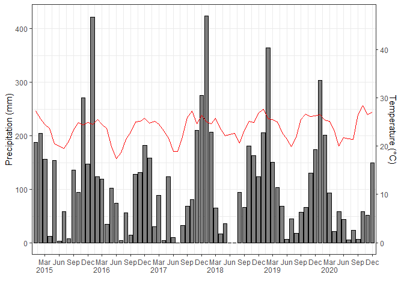
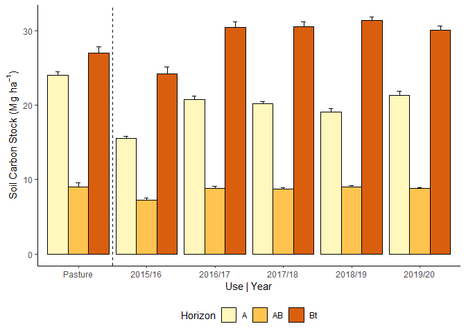

<!-- README.md is generated from README.Rmd. Please edit that file -->

# carbono-camila

``` r
library(tidyverse)
library(lubridate)
library(scales)
library(readxl)
library(patchwork)
library(hrbrthemes)
```

#### Gráfico de temperatura e umidade

``` r
clima <- read_excel("data/Dados_climáticos_completo_V2.xlsx",
                    sheet="Planilha1") %>% 
  janitor::clean_names() %>% 
  mutate(
    ano = as.numeric(ano),
    dia = as.numeric(dia),
    mes = as.numeric(mes),
    data = make_date(year=ano,day=dia,month=mes)
  )
```

``` r
coeff=9
a=1
clima %>% filter(ano > 2014) %>% 
  mutate(month_year = make_date(year=ano, month= mes, day=1)) %>% 
  group_by(month_year) %>% 
  summarise(
    rain = sum(precipitacoa),
    tmedia = mean(tmedia),
    tmin =mean(tmin),
    tmax =mean(tmax),
  ) %>% 
  ggplot(aes(x=month_year,y=rain)) +
  geom_col(color="black",fill="gray")+
  geom_line(aes(y = a + tmedia*coeff), color = "red") +
  geom_line(aes(y = a + tmin*coeff), color = "black",lty=3) +
  geom_line(aes(y = a + tmax*coeff), color = "black",lty=3) +
  scale_y_continuous(
    name = "Precipitation (mm)",
    sec.axis = sec_axis(~ (. - a)/coeff, name="Temperature (°C)")
  ) +
  # scale_x_date(name = "Data",date_breaks = "12 months",
  #               date_labels = "%Y") +
  scale_x_date(name = "Date",date_breaks = "3 months",
              # date_labels = "%b",
              labels = label_date_short(format = c("%Y", "%b", NA, NA)),
              expand = c(0.005,0.005)
              ) +
  theme_classic() +
  theme(legend.background = element_rect(fill = "transparent"), 
        legend.box.background = 
          element_rect(fill = "transparent", colour = NA),
        legend.key = element_rect(fill = "transparent"), 
        legend.spacing = unit(-1, "lines"))
```

<!-- -->

``` r
  # theme(axis.text.x=element_text(angle=45))
```

#### Gráfico da Produção mostrando a semelhança entre os SPS

``` r
prod <- read_xlsx("data/Qualid.Industrial e prod. 1, 2 ,3,  4 e 5.xlsx") %>% 
  janitor::clean_names()
glimpse(prod)
#> Rows: 195
#> Columns: 13
#> $ colheita            <dbl> 1, 1, 1, 1, 1, 1, 1, 1, 1, 1, 1, 1, 1, 1, 1, 1, 1,~
#> $ planta_de_cobertura <chr> "Amendoim", "Amendoim", "Amendoim", "Amendoim", "A~
#> $ sps                 <chr> "PD", "PD", "PD", "CM", "CM", "CM", "PP", "PP", "P~
#> $ bloco               <chr> "B1", "B2", "B3", "B1", "B2", "B3", "B1", "B2", "B~
#> $ brix                <dbl> 21.39, 20.13, 21.25, 22.24, 22.08, 20.94, 21.48, 2~
#> $ pol                 <dbl> 18.220, 17.110, 18.120, 19.630, 18.660, 16.980, 18~
#> $ pureza              <dbl> 85.18, 85.00, 85.27, 88.26, 84.51, 81.09, 84.82, 8~
#> $ ar                  <dbl> 0.9112, 1.3560, 1.0885, 0.6916, 0.9997, 1.3221, 1.~
#> $ pc                  <dbl> 15.4173, 14.2291, 14.9944, 16.5005, 15.6563, 14.16~
#> $ fibra               <dbl> 12.04, 13.01, 13.35, 12.44, 12.51, 12.85, 11.74, 1~
#> $ ar_cana             <dbl> 0.77110, 1.12820, 0.90030, 0.58120, 0.83910, 1.103~
#> $ atr                 <dbl> 155.55, 147.37, 152.66, 164.24, 158.47, 146.49, 15~
#> $ producao            <dbl> 88.30000, 119.00000, 110.18519, 128.63704, 85.6592~
```

``` r
prod %>% 
  group_by(sps,colheita) %>% 
  summarise(
    prod_mean = mean(producao),
    n = n(),
    stde = sd(producao)/sqrt(n)
  ) %>% 
  ggplot(aes(x=colheita, y=prod_mean, fill=sps)) +
  geom_col(position="dodge") +
  scale_fill_viridis_d() +
  theme_classic()+
  geom_errorbar(aes(ymin=prod_mean, ymax=prod_mean+stde), width=.2,
                 position=position_dodge(.9))
```

<!-- -->

### Boxplot para estudo de possíveis *ouliers*

``` r
prod %>% 
  group_by(sps, colheita) %>% 
  ggplot(aes(x=as_factor(colheita), y=producao, fill=sps)) +
  geom_boxplot() +
  # facet_wrap(~sps)+
  scale_fill_viridis_d() +
  theme_classic()
```

<!-- -->

``` r
prod %>% 
  group_by(sps, colheita) %>% 
  ggplot(aes(x=producao, fill=sps)) +
  geom_density(alpha=.5) +
  facet_wrap(~colheita,ncol=3)+
  scale_fill_viridis_d() +
  theme_classic()+
  theme(legend.position = "bottom")
```

<!-- -->

#### estoque de carbono, mostrar ao longo do tempo em função do sistema de preparo e depois pelo sistema de cobertura

``` r
atributos <- read_xlsx("data/Dados Gerais.xlsx") %>% 
  janitor::clean_names()
atributos <- atributos %>% 
  mutate(
    cultura = str_remove(str_extract(tratamento, ".*_"),"_")
  )
glimpse(atributos)
#> Rows: 585
#> Columns: 22
#> $ ciclo            <dbl> 1, 1, 1, 1, 1, 1, 1, 1, 1, 1, 1, 1, 1, 1, 1, 1, 1, 1,~
#> $ tratamento       <chr> "amendoim_pd", "amendoim_pd", "amendoim_pd", "amendoi~
#> $ cultura          <chr> "amendoim", "amendoim", "amendoim", "amendoim", "amen~
#> $ preparo          <chr> "pd", "pd", "pd", "pd", "pd", "pd", "pd", "pd", "pd",~
#> $ linha_entrelinha <chr> "Média_ponderada", "Média_ponderada", "Média_ponderad~
#> $ profundidade     <chr> "0_20", "0_20", "0_20", "20_30", "20_30", "20_30", "3~
#> $ bloco            <chr> "b1", "b2", "b3", "b1", "b2", "b3", "b1", "b2", "b3",~
#> $ ds               <dbl> 1.541851, 1.656825, 1.490723, 1.663634, 1.663012, 1.6~
#> $ macro            <dbl> 0.22259881, 0.15329831, 0.19500683, 0.14215579, 0.144~
#> $ micro            <dbl> 0.2045018, 0.2310544, 0.2080318, 0.2416834, 0.2400504~
#> $ pt               <dbl> 0.4271007, 0.3843528, 0.4030386, 0.3838392, 0.3840695~
#> $ dp               <dbl> 2.69, 2.69, 2.69, 2.70, 2.70, 2.70, 2.69, 2.69, 2.69,~
#> $ rp               <dbl> 1.0076667, 1.0002333, 0.9988667, 1.4013000, 1.9214000~
#> $ dmp              <dbl> 0.7394362, 0.6215094, 0.6568675, 0.9229124, 0.9356794~
#> $ p_resina         <dbl> 3.198333, 3.531667, 2.910000, 1.000000, 1.730000, 1.0~
#> $ p_h              <dbl> 5.103500, 5.436167, 5.270333, 4.254000, 4.700000, 4.9~
#> $ k                <dbl> 0.7126667, 0.7558333, 0.6550000, 0.2000000, 0.3270000~
#> $ ca               <dbl> 14.573333, 15.406667, 14.370000, 12.460000, 9.540000,~
#> $ mg               <dbl> 7.509167, 7.171667, 7.846667, 4.365000, 4.405000, 5.5~
#> $ h_al             <dbl> 17.41333, 16.43167, 17.45000, 25.00000, 20.67500, 23.~
#> $ c                <dbl> 4.712640, 5.443577, 4.704227, 4.002810, 5.348700, 4.6~
#> $ est_c            <dbl> 15.492918, 17.443401, 15.559664, 6.941640, 9.261756, ~
```

``` r
atributos %>% 
  group_by(ciclo,preparo,profundidade) %>% 
  summarise(EstC = mean(est_c),
            n = n(),
            stde = sd(est_c)/sqrt(n)
            ) %>% 
  group_by(ciclo, preparo) %>% 
  summarise(EstC = sum(EstC),
            stde = sum(stde)
            )  %>% 
  ggplot(aes(x=ciclo, y=EstC, fill=preparo)) +
  geom_col(position="dodge") +
  scale_fill_viridis_d() +
  theme_classic()+
  geom_errorbar(aes(ymin=EstC, ymax=EstC+stde), width=.2,
                 position=position_dodge(.9))
```

<!-- -->

``` r
atributos %>% 
  group_by(ciclo,cultura,profundidade) %>% 
  summarise(EstC = mean(est_c),
            n = n(),
            stde = sd(est_c)/sqrt(n)
            ) %>% 
  group_by(ciclo, cultura) %>% 
  summarise(EstC = sum(EstC),
            stde = sum(stde)
            )  %>% 
  ggplot(aes(x=ciclo, y=EstC, fill=cultura)) +
  geom_col(position="dodge") +
  scale_fill_viridis_d() +
  theme_classic()+
  geom_errorbar(aes(ymin=EstC, ymax=EstC+stde), width=.2,
                 position=position_dodge(.9))
```

<!-- --> \####
densidade do solo/ carbono orgânico/ e possivelmente DMP

``` r
atributos %>% 
  group_by(ciclo,preparo,profundidade) %>% 
  summarise(ds_m = mean(ds),
            n = n(),
            stde = sd(ds)/sqrt(n)
            ) %>% 
  group_by(ciclo, preparo) %>% 
  # summarise(ds_m = mean(ds_m),
  #           stde = mean(stde)
  #           )  %>% 
  ggplot(aes(x=ciclo, y=ds_m, fill=preparo)) +
  geom_col(positio = "dodge") +
  scale_fill_viridis_d() +
  facet_wrap(~profundidade,nrow=1) +
  theme_classic()+
  geom_errorbar(aes(ymin=ds_m, ymax=ds_m+stde), width=.2,
                 position=position_dodge(.9)) +
  coord_cartesian(ylim=c(1.5,1.8))+
  theme(legend.position = "top")
```

<!-- -->

``` r
atributos %>% 
  group_by(ciclo,preparo,profundidade) %>% 
  summarise(c_m = mean(c),
            n = n(),
            stde = sd(c)/sqrt(n)
            ) %>% 
  group_by(ciclo, preparo) %>% 
  # summarise(ds_m = mean(ds_m),
  #           stde = mean(stde)
  #           )  %>% 
  ggplot(aes(x=ciclo, y=c_m, fill=preparo)) +
  geom_col(positio = "dodge") +
  scale_fill_viridis_d() +
  facet_wrap(~profundidade,nrow=1) +
  theme_classic()+
  geom_errorbar(aes(ymin=c_m, ymax=c_m+stde), width=.2,
                 position=position_dodge(.9)) +
  coord_cartesian(ylim=c(3.5,8))+
  theme(legend.position = "top")
```

<!-- -->

``` r
atributos %>% 
  group_by(ciclo,preparo,profundidade) %>% 
  summarise(dmp_m = mean(dmp),
            n = n(),
            stde = sd(dmp)/sqrt(n)
            ) %>% 
  group_by(ciclo, preparo) %>% 
  # summarise(ds_m = mean(ds_m),
  #           stde = mean(stde)
  #           )  %>% 
  ggplot(aes(x=ciclo, y=dmp_m, fill=preparo)) +
  geom_col(positio = "dodge") +
  scale_fill_viridis_d() +
  facet_wrap(~profundidade,nrow=1) +
  theme_classic()+
  geom_errorbar(aes(ymin=dmp_m, ymax=dmp_m+stde), width=.2,
                 position=position_dodge(.9)) +
  coord_cartesian(ylim=c(0.25,1))+
  theme(legend.position = "top")
```

<!-- -->

### finalemnte o HLIF ano 1 e 5 somente
